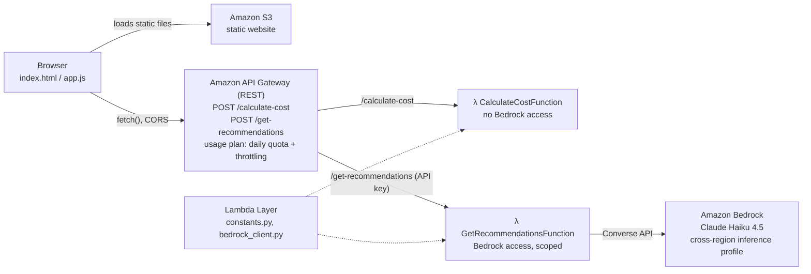

# MeetValue

**Know the cost. Maximize the value.**

MeetValue shows the real dollar cost of a meeting while you plan it, based on who is attending, their seniority and the meeting length. It then asks **Claude Haiku 4.5 on Amazon Bedrock** for concrete ways to reduce that cost. The suggestions weigh each attendee's *role* against the meeting's *subject*, so they go beyond "invite fewer people".

**Live app:** http://meetcost-frontend-022076688911.s3-website-us-east-1.amazonaws.com

Built for the **AWS Zero to Shipped** hackathon · Category **Workplace Efficiency** · Lane **Startups** · Built with **[Kiro](https://kiro.dev)** (spec-driven development and AWS deployment)

- [Why MeetValue: the pitch](pitch.md): the problem, the data and where the product is headed
- [Proof that the coding agent was connected to AWS](hackathon-evidence/README.md)

---

## What it does

1. **Enter a meeting**: its subject, duration, and each attendee's name, role (e.g. "Backend Developer", "VP Sales") and seniority level.
2. **See the cost**: a headline number ("This meeting costs your company $650") and a per-person breakdown. Each seniority level has a default hourly rate (Junior $50, Mid-level $100, Senior $200, Executive $400), which you can override per attendee.
3. **Get AI recommendations**: partial attendance, a shorter duration or consolidation, each with an estimated dollar saving, plus the best savings opportunity highlighted (savings aren't summed, since recommendations can overlap).
4. **See it over time**: for a recurring meeting, set how often it happens (per week or per month) to see its monthly and annual cost.

Example from the live app, for a 60-minute *"Q4 sales pipeline review"* with a VP Sales, a Senior Account Executive and a Junior Backend Developer:

> **Partial attendance, save $50:** *"Bob is a Backend Developer whose technical expertise is not relevant to a Q4 sales pipeline review…"*
>
> **Duration reduction, save $162.50:** *"…A 15-minute reduction is achievable without sacrificing substantive discussion."*

### What makes it different

- **Role-aware, not just cost-aware.** Cost alone is the wrong signal. A $400/hr executive whose expertise is the point of the meeting shouldn't be cut, while a $50/hr developer sitting through a sales review probably should be. The prompt asks Claude to judge whether each attendee's expertise is relevant to the subject.
- **Trustworthy numbers.** The AI decides *who* and *what*. The app computes the savings deterministically from the real hourly rates, so the dollar figures never depend on a model doing arithmetic.
- **Graceful degradation.** If Bedrock is unavailable or returns something unparseable, the cost breakdown is still shown.

## Architecture



| AWS service | Role |
|---|---|
| **Amazon S3** | Hosts the static frontend (plain HTML/CSS/JS, no build step) |
| **Amazon API Gateway** | Public REST API, CORS, and a usage plan that limits the AI endpoint |
| **AWS Lambda** (Python 3.12) | Two functions: cost calculation (pure arithmetic) and AI recommendations |
| **Amazon Bedrock** | Claude Haiku 4.5 through the Converse API, with structured JSON output |
| **AWS SAM / CloudFormation** | All infrastructure defined in [`infrastructure/template.yaml`](infrastructure/template.yaml) |
| **IAM** | One least-privilege role per function |

### Design decisions

- **Two functions instead of one.** The cost function has no AI permissions at all. Only the recommendations function can call Bedrock, so a bug in the AI path can't reach broader permissions.
- **Structured output instead of text parsing.** Claude returns a JSON array with a fixed schema (`category`, `affected_attendee_names`, `duration_reduction_minutes`, `reasoning`), and the app computes the savings from it.
- **Stateless, no database.** Every calculation is a pure function of its inputs, so there is no idle cost and nothing to secure at rest.
- **Claude Haiku 4.5.** It is fast and cheap, and classifying attendees and writing a short justification doesn't need a larger model. `max_tokens` is capped at 500 per call.

## Security and cost

- **Least-privilege IAM.** The Bedrock permission is scoped to the exact Claude Haiku 4.5 inference-profile and foundation-model ARNs. The AWS Marketplace permission Bedrock needs on first use is restricted to Claude Haiku 4.5's product ID, and only applies when Bedrock itself is the caller (`aws:CalledViaLast`).
- **No credentials in code.** The Lambdas authenticate through their IAM execution roles.
- **Spend limits on the AI endpoint.** Every `/get-recommendations` call is a paid Bedrock call on a public API, so the route requires an API Gateway usage-plan key, limited to 2,000 calls/day and 2 req/s, and all routes are limited to 10 req/s. AWS applies these limits on a best-effort basis. An AWS Budgets alert is set as a second safety net. The key is sent by the browser, so it is not a secret. It is kept out of the repo in a gitignored config file.
- **Known trade-offs for a hackathon MVP:** CORS is open (`*`) rather than scoped to the site's origin, and the S3 website endpoint is HTTP only (CloudFront would add HTTPS).

## How it was built

### Spec-driven development with Kiro

The project started from specs in [`.kiro/specs/meetcost-web-app/`](.kiro/specs/meetcost-web-app/):

- `requirements.md` contains user stories and EARS acceptance criteria.
- `design.md` covers components, data models and prompt templates.
- `tasks.md` is a dependency-ordered implementation plan.

Steering docs in [`.kiro/steering/`](.kiro/steering/) kept product intent, tech constraints and file structure consistent. Kiro generated both Lambdas, the shared Bedrock client, the frontend and the SAM template from these specs. It then iterated on two features that touched the whole data flow: a per-attendee role and editable hourly rates.

### Shipping it: Kiro on the live AWS account

Kiro also deployed the app from its terminal, against the real AWS account. It ran `sam build` / `sam deploy`, created the artifacts bucket, and deleted a stuck stack, polling `describe-stacks` until AWS confirmed the deletion. It also diagnosed IAM permission gaps and synced the frontend to S3. The stack was created on 2026-09-22 and updated 8 times on 2026-09-24 during live debugging. The CloudFormation history is in [`hackathon-evidence/`](hackathon-evidence/).

### Issues found and fixed on the way to production

1. **Wrong Bedrock message format.** The generated client used the Anthropic Messages API shape (`{"type": "text", "text": ...}`) instead of Bedrock Converse's (`{"text": ...}`). This was caught in code review: botocore rejects it client-side, so every AI call would have failed.
2. **Missing CORS headers.** SAM's `Cors` block only covers the `OPTIONS` preflight. With Lambda proxy integration, the real `POST` responses must return `Access-Control-Allow-Origin` themselves.
3. **Shared code missing from the Lambda packages.** Inspecting the `sam build` output showed `constants.py` wasn't in either function package. Both would have crashed at import. The fix was a Lambda Layer with `BuildMethod: python3.12`, verified with `sam local invoke` before the first deploy.
4. **S3 bucket policy.** `PolicyText` was used instead of `PolicyDocument`, and the bucket needed an explicit `PublicAccessBlockConfiguration` before it could serve the site publicly.
5. **"On-demand throughput isn't supported."** Claude Haiku 4.5 must be called through the cross-region inference profile (`us.anthropic.claude-haiku-4-5-20251001-v1:0`), with IAM covering both the profile ARN and the foundation-model ARN in every region it routes to.
6. **Markdown-fenced JSON.** Claude sometimes wrapped its JSON in a ```` ```json ```` fence, which silently triggered the fallback. A `strip_markdown_fence()` helper fixed it, with a regression test.
7. **AWS Marketplace permissions.** Errors were invisible in CloudWatch until a `logger.error()` was added. That surfaced an `AccessDeniedException` on `aws-marketplace:Subscribe`. The policy went through four least-privilege iterations to reach AWS's published pattern instead of `aws-marketplace:*`.

A final pre-submission pass with Claude Code added the API Gateway usage plan that limits AI spend.

## Repository layout

```
frontend/              static site: index.html, css/, js/app.js, js/config.example.js
backend/functions/     calculate_cost/ and get_recommendations/ Lambda handlers + parser tests
backend/shared/        constants.py, bedrock_client.py (deployed as a Lambda Layer)
infrastructure/        template.yaml (AWS SAM)
.kiro/                 Kiro specs and steering docs
hackathon-evidence/    proof of the coding agent's AWS connection
pitch.md               why MeetValue matters
```

## Run the tests

The parser tests need no AWS credentials (Bedrock is mocked), only `boto3`:

```bash
pip install -r backend/requirements.txt
cd backend/functions/calculate_cost && python test_parser.py
cd ../get_recommendations && python test_parser.py
```

## Deploy your own

Prerequisites: AWS CLI and SAM CLI, Python 3.12, and Bedrock model access to Claude Haiku 4.5 in `us-east-1`.

```bash
cd infrastructure
sam build
sam deploy --guided            # stack name, region us-east-1, CAPABILITY_IAM
```

Then configure and upload the frontend:

```bash
cp frontend/js/config.example.js frontend/js/config.js
# API_BASE_URL: the ApiEndpoint stack output
# RECOMMENDATIONS_API_KEY:
aws apigateway get-api-keys --include-values --query 'items[].value'

aws s3 sync frontend/ s3://<FrontendBucket>/ --exclude 'js/config.example.js'
```

## What's next

- **Calendar integration** (Google Calendar / Outlook): show the cost and suggestions inside the invite flow, at the moment of decision. This is the planned paid tier of a freemium, per-team SaaS.
- **Apply and recalculate**: accept a suggestion and watch the cost update live.
- **Team meeting spend over time**: "your team spent $X on meetings this month, $Y of it avoidable".
- HTTPS via CloudFront, CORS scoped to the site's origin, and a CI-run test suite.

## License

[MIT](LICENSE)
