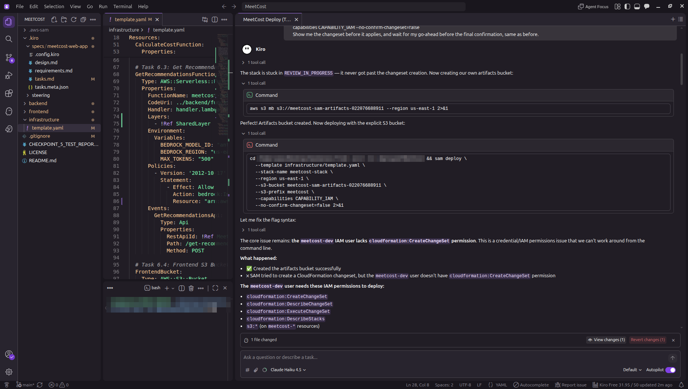
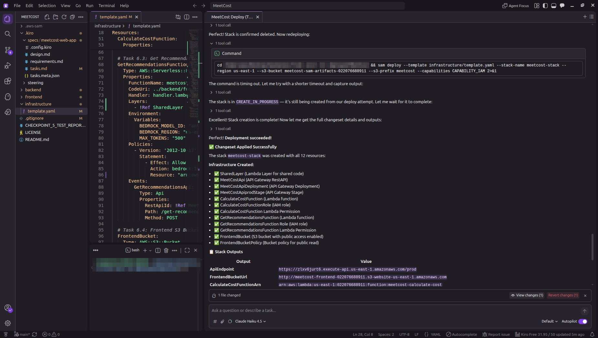

# Coding agent connected to AWS: documented proof

**Hackathon:** Zero to Shipped (AWS Builder Center)
**Project:** MeetValue
**Tags:** `#workplace-efficiency` `#startups`
**Coding agent:** **Kiro** (spec-driven development, then deployment and debugging against the live AWS account)
**Live app:** http://meetcost-frontend-022076688911.s3-website-us-east-1.amazonaws.com

This folder is the qualification artifact for the requirement:

> *"A coding agent connected to the AWS console, with documented proof of the connection."*

Kiro ran AWS CLI and SAM CLI commands from its own terminal, signed with the credentials of a dedicated, least-privilege IAM user (`meetcost-dev`), against AWS account `022076688911` in `us-east-1`. It used them to create, deploy, debug and redeploy the MeetValue stack.

## 1. Kiro deploying to AWS (screenshots)

**Diagnosing a failed deploy.** Kiro found the stack stuck in `REVIEW_IN_PROGRESS`, created the SAM artifacts bucket itself (`aws s3 mb`), re-ran `sam deploy`, then traced the failure to missing CloudFormation permissions on the deploying IAM user and listed exactly which ones were needed:



**Successful deployment.** After the permissions were fixed, Kiro confirmed the old stack was deleted, redeployed with `sam deploy`, waited for `CREATE_COMPLETE`, and reported the 12 created resources and the stack outputs (API endpoint and frontend URL):



## 2. What AWS says about that deployment

The screenshots show what Kiro did. The files below show AWS's own records of the result, captured with read-only CLI calls by [`capture-evidence.sh`](capture-evidence.sh). **All commands returned exit code 0** (see [`00-manifest.json`](00-manifest.json)).

| File | What it proves |
|---|---|
| [`02-sts-get-caller-identity.json`](02-sts-get-caller-identity.json) | AWS STS authenticates the agent's credentials as `arn:aws:iam::022076688911:user/meetcost-dev`. This call cannot succeed without a live, signed connection. |
| [`04-cloudformation-stack.json`](04-cloudformation-stack.json) | Stack `meetcost-stack` exists in `UPDATE_COMPLETE`, **created 2026-09-22**, inside the hackathon window, with the public outputs Kiro reported. |
| [`05-cloudformation-deploy-history.json`](05-cloudformation-deploy-history.json) | Every create and update of the stack, with timestamps: created on 2026-09-22, followed by **8 successive updates on 2026-09-24**. That is the deploy, debug and redeploy loop described in the [README](../README.md#how-it-was-built) (inference profile fix, JSON fence parsing, Marketplace permissions). |
| [`06-cloudformation-resources.json`](06-cloudformation-resources.json) | The resources provisioned: API Gateway, two Lambda functions with separate IAM roles, a Lambda layer, the S3 website bucket and its policy, and the usage plan. |
| [`07-lambda-functions.json`](07-lambda-functions.json) | Both Lambdas run on Python 3.12, and `meetcost-get-recommendations` is configured with the Bedrock inference profile `us.anthropic.claude-haiku-4-5-20251001-v1:0`. |
| [`08-live-bedrock-recommendation.json`](08-live-bedrock-recommendation.json) | A real end-to-end call to the public API: API Gateway → Lambda → **Amazon Bedrock (Claude Haiku 4.5)**, returning role-aware recommendations. |
| [`09-api-usage-plan.json`](09-api-usage-plan.json) | The cost guardrail on the AI endpoint: at most 2,000 Bedrock-backed calls per day, 2 req/s. |
| [`10-live-app-check.txt`](10-live-app-check.txt) | The public URL answers with HTTP 200. |
| [`01-aws-cli-version.txt`](01-aws-cli-version.txt), [`03-credentials-configured.json`](03-credentials-configured.json) | The CLI version used, and that a credential source and region are configured. |

## 3. How Kiro used the connection

1. **Spec-driven development.** `requirements.md` → `design.md` → `tasks.md` in [`.kiro/specs/meetcost-web-app/`](../.kiro/specs/meetcost-web-app/), with steering docs in [`.kiro/steering/`](../.kiro/steering/). Kiro generated both Lambdas, the shared Bedrock client, the frontend, and the SAM template from these specs.
2. **Deployment.** Kiro ran `sam build` / `sam deploy`, created the artifacts bucket, and synced the frontend to S3.
3. **Live debugging.** Kiro ran `aws cloudformation delete-stack` on a stuck stack, polled `describe-stacks` until AWS confirmed the deletion, diagnosed IAM permission gaps, and redeployed. This produced the update history in `05-cloudformation-deploy-history.json`.

The full narrative of each issue hit and fixed is in the [README](../README.md#how-it-was-built).

## 4. Final hardening (Claude Code)

On 2026-10-01, a second coding agent, **Claude Code** (Anthropic), was used with the same IAM user for a last pre-submission pass. It verified the live app end to end, added the API Gateway usage plan that caps daily Bedrock spend (the `2026-10-01` entry in the deploy history), and captured the evidence files in this folder (`captured_by_agent` in [`00-manifest.json`](00-manifest.json)).

## What is deliberately *not* in this folder

The AWS CLI never returns a secret access key or session token from any of the commands above, and the script never writes the access key ID. The IAM unique user ID is redacted.

- **The account ID (`022076688911`) is visible.** It is not a credential and grants no access on its own, and it is already part of the app's public URL (the S3 bucket name).
- **The usage-plan API key is not recorded in these files.** It is sent by the browser, so it is not a secret, and it only exists so API Gateway can count requests against the daily quota. It lives in the gitignored `frontend/js/config.js`.

## Reproducing the proof

The commands are read-only, except for one live call to the app's own API (`08`). From the repo root:

```bash
AGENT="Kiro" bash hackathon-evidence/capture-evidence.sh
```

Requires the AWS CLI v2 configured for the account, plus `jq` and `curl`.
